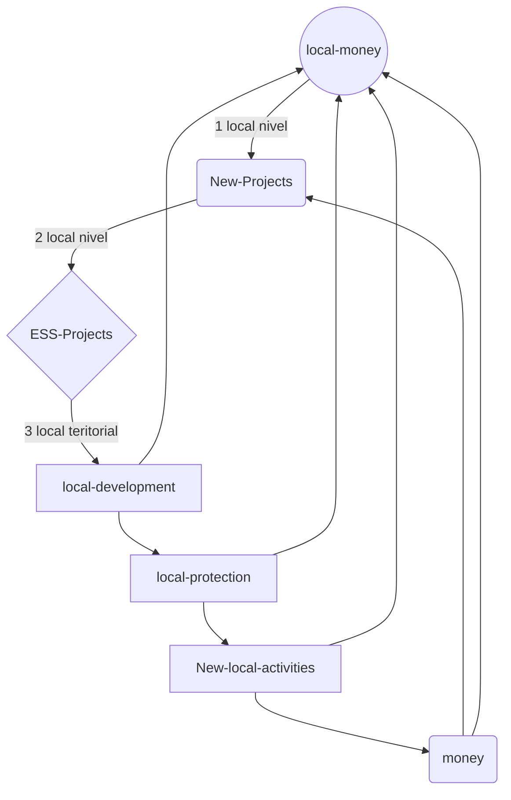

# LocalCurrencies
Local currencies on blockchain

<!-- Projects --> 
<h2 align="center">🔥New project🔥</h2>
<div align="center">	
  <table>
        <tr>
            <td width="50%">
                <h3 align="center">I am looking for help for a blockchain project.</h3>
                    <p align="center">
                        Local currencies on blockchain. 
                    </p>
		    <p align="center">
			    <a href="mailto:scorven7@gmail.com" target="_blank"> SEND A EMAIL </a>
		    </p>
		</td>
            <td width="50%">
                <h3 align="center">General idea</h3>
             <p align="center">
             	Protéger les territoires et la production alimentaire avec des monnaies locales.
             	Projet qui s'inscrit dans un cadre ESS et environnemental.
             	<br>
             	Protect territories and food production with local currencies.
              	Project that falls within an SSE and environmental framework.
             </p>
            </td>
        </tr>
  </table>
</div>

<!-- 👯 Je cherche à collaborer **pour sauver le monde.** -->
 ## Local currencies on blockchain : shemas général
<!-- shemas --> 



```javascript
const franckdun = new Project_Blockchain();
function autonomousWorld() {
  if(franckdun.colaborater > 0){
    return console.log("Great, I walk with you! We have no more oil but we still have ideas!");
  }
 return console.log("Sorry, i can do nothing for save the world.");
}
```

<details><summary>CLICK ME</summary>
<p>

#### We have to find a place to start!

```topojson
 {
   "type": "Topologie",
   "transformer": {
     "échelle": [0.0005000500050005, 0.00010001000100010001],
     "traduire": [100, 0]
   },
   "objets": {
     "Exemple": {
       "type": "GeometryCollection",
       "géométries": [
         {
           "type": "Point",
           "propriétés": {"prop0": "valeur0"},
           "coordonnées": [4000, 5000]
         },
         {
           "type": "ChaîneLigne",
           "propriétés": {"prop0": "valeur0", "prop1": 0},
           "arcs": [0]
         },
         {
           "type": "Polygone",
           "propriétés": {"prop0": "valeur0",
             "prop1": {"ceci": "cela"}
           },
           "arc": [[1]]
         }
       ]
     }
   },
   "arcs": [[[4000, 0], [1999, 9999], [2000, -9999], [2000, 9999]],[[0, 0], [0, 9999], [2000, 0] , [0, -9999], [-2000, 0]]]
 }
 ```

</p>
</details>


 
